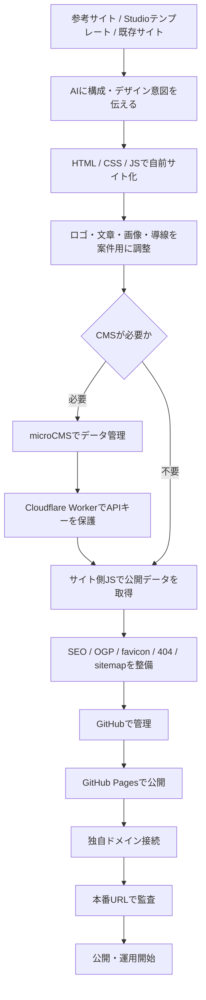
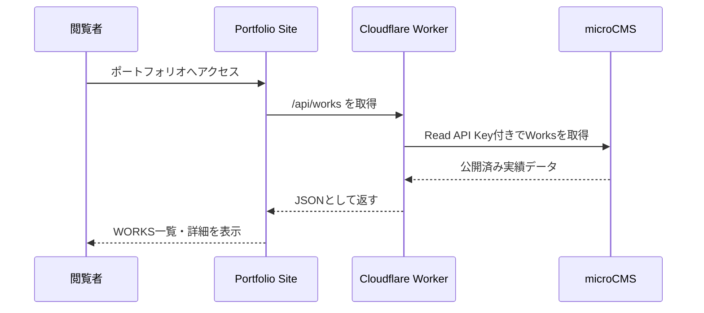
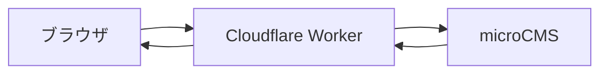

# AIサイト制作ワークフロー

## 目的

このドキュメントは、NOFTポートフォリオ制作で実際に行った流れを、次のサイト制作にも応用できるように整理したものです。

基本方針は、ノーコードツールや既存テンプレートで作られた完成イメージを参照しながら、AIとの対話で自前コードのWebサイトとして再構築し、CMS、公開、SEO、運用準備まで仕上げることです。

今回のNOFTポートフォリオでは、Studioテンプレート由来のデザインを参考にしつつ、NOFT用のオリジナルポートフォリオとして再設計し、GitHub Pages、独自ドメイン、microCMS、Cloudflare Workerまで含めて公開運用できる状態にしました。

## この手法の名前

**AIディレクション型コードサイト制作**

または

**ノーコード参照 × AI実装型サイト制作**

ユーザーがディレクターとして方向性、素材、修正指示を出し、AIが設計、実装、修正、公開補助、監査を担当する制作スタイルです。

## 今回の完成状態

### 公開URL

- ポートフォリオ本体: https://portfolio.noft-designworks.com/
- 実績詳細ページ: https://portfolio.noft-designworks.com/works/noguchi-juken/
- 本体サイト: https://noft-designworks.com/
- 見積りシミュレーター: https://estimate.noft-designworks.com/

### 使用した主な技術

- HTML / CSS / JavaScript
- GitHub / GitHub Pages
- 独自ドメイン / CNAME
- microCMS
- Cloudflare Worker / Wrangler
- Google Fonts
- OGP画像 / favicon / webmanifest
- robots.txt / sitemap.xml
- JSON-LD構造化データ

### 役割分担

| 項目 | 役割 |
| --- | --- |
| HTML | ページの骨組み |
| CSS | デザイン、レイアウト、レスポンシブ |
| JavaScript | CMS取得、WORKS表示、詳細表示、フィルター、CTA、演出 |
| microCMS | 制作実績データの管理 |
| Cloudflare Worker | microCMS APIキーを隠して安全にデータを返す中継役 |
| GitHub | コード管理 |
| GitHub Pages | 静的サイト公開 |
| CNAME | 独自ドメイン接続 |
| robots.txt | 検索エンジンへの巡回指示 |
| sitemap.xml | 検索エンジン向けのページ一覧 |
| JSON-LD | Googleなどにサイト構造を伝える構造化データ |

## 全体像



## サイト構成

```text
noft_portfolio/
├─ index.html
├─ about/index.html
├─ works/index.html
├─ works/detail/index.html
├─ works/noguchi-juken/index.html
├─ contact/index.html
├─ privacy-policy/index.html
├─ 404.html
├─ assets/
│  ├─ noft-logo.png
│  ├─ ogp.png
│  ├─ favicon-48.png
│  └─ icon-192.png
├─ site-data.js
├─ site.js
├─ styles.css
├─ robots.txt
├─ sitemap.xml
├─ site.webmanifest
├─ CNAME
└─ code/
   ├─ microcms-worker.js
   ├─ wrangler.microcms.jsonc
   ├─ microcms-deploy-steps.md
   └─ microcms-next-steps.md
```

## データの流れ



## 今回作ったページ

| ページ | ファイル | 役割 | SEO方針 |
| --- | --- | --- | --- |
| HOME | `index.html` | トップ、ヒーロー、実績抜粋、CTA | index |
| ABOUT | `about/index.html` | プロフィール、ツール、サービス | index |
| WORKS | `works/index.html` | 実績一覧、カテゴリフィルター | index |
| 実績詳細 | `works/noguchi-juken/index.html` | ノグチ重建株式会社の静的詳細ページ | index |
| 汎用詳細 | `works/detail/index.html` | `?slug=` 用の動的詳細ページ | noindex,follow |
| CONTACT | `contact/index.html` | 問い合わせ導線 | index |
| PRIVACY POLICY | `privacy-policy/index.html` | 個人情報の取り扱い | index |
| 404 | `404.html` | 存在しないページの受け皿 | noindex,follow |

## Studio設定との対応表

| Studio側の考え方 | 自前コードでの対応 |
| --- | --- |
| ページタイトル | 各HTMLの `<title>` |
| ディスクリプション | `<meta name="description">` |
| OGPタイトル | `<meta property="og:title">` |
| OGP説明文 | `<meta property="og:description">` |
| OGP画像 | `/assets/ogp.png` |
| favicon | `/assets/favicon-48.png` |
| Apple touch icon | `/assets/icon-192.png` |
| head内カスタムコード | 各HTMLの `<head>` 内へ直接記述 |
| サイト公開 | GitHub Pages |
| 独自ドメイン | `CNAME` とDNS設定 |
| CMS | microCMS |
| CMS API接続 | Cloudflare Worker |
| 404ページ | `404.html` |
| サイトマップ | `sitemap.xml` |
| robots設定 | `robots.txt` |
| 構造化データ | JSON-LD |

## 制作フロー

### 1. 参考サイト・完成イメージを決める

最初に、参考にするデザインや構成を決めます。今回の場合は、Studioテンプレート由来の完成イメージを基準にしました。

確認すること:

- どのページが必要か
- ヘッダー、フッター、CTAの形
- フォント、ロゴ、余白
- 画像の見せ方
- スマホ表示
- CMSが必要な部分

### 2. 自前コードで再構築する

Studioのように部品を置くのではなく、HTML、CSS、JavaScriptで同等の構成を作ります。

今回の主なファイル:

- `index.html`
- `about/index.html`
- `works/index.html`
- `works/detail/index.html`
- `contact/index.html`
- `privacy-policy/index.html`
- `404.html`
- `styles.css`
- `site.js`
- `site-data.js`

### 3. デザインを案件用に調整する

参考デザインをそのまま複製するのではなく、案件に合わせて変えます。

今回調整したもの:

- NOFTロゴ
- HOME / ABOUT / WORKS / OFFICIAL のナビゲーション
- 実績一覧、実績詳細
- 下部CTA、見積りシミュレーター導線、お問い合わせ導線
- フッター
- スクロール時のヘッダー挙動
- back to top
- スマホ下部CTA

### 4. CMSが必要な部分を切り出す

WORKSは今後増えるため、HTML直書きではなくmicroCMS管理にしました。

microCMSの主なフィールド:

- `title`
- `slug`
- `siteUrl`
- `categories`
- `thumbnail`
- `gallery`
- `summary`
- `approach`
- `production`
- `sortOrder`

### 5. APIキーを隠す

ブラウザからmicroCMSを直接叩くとAPIキーが見える可能性があります。そのため、Cloudflare Workerを中継にしました。



Worker側にsecretとして以下を保存します。

- `MICROCMS_SERVICE_DOMAIN`
- `MICROCMS_API_KEY`

サイト側にはWorkerの公開URLだけを書きます。

```js
worksApiUrl: "https://noft-microcms-proxy.koomor1202.workers.dev/api/works"
```

### 6. GitHubでコード管理する

基本コマンド:

```powershell
git status --short
git add .
git commit -m "Commit message"
git push origin main
```

今回のGitHub:

```text
https://github.com/koomor1202/noft-portfolio
```

### 7. GitHub Pagesで公開する

GitHub Pagesを使って静的サイトとして公開します。

今回の独自ドメイン:

```text
portfolio.noft-designworks.com
```

リポジトリ内の `CNAME`:

```text
portfolio.noft-designworks.com
```

### 8. 見えない設定を整える

公開品質を上げるために、以下を整えます。

#### head

各ページで設定:

- `title`
- `description`
- `robots`
- `canonical`
- `og:title`
- `og:description`
- `og:url`
- `og:image`
- `twitter:card`
- `theme-color`
- `referrer`
- `favicon`
- `apple-touch-icon`
- `manifest`

#### favicon

今回の設定:

```html
<link rel="icon" type="image/png" sizes="48x48" href="/assets/favicon-48.png">
<link rel="apple-touch-icon" sizes="192x192" href="/assets/icon-192.png">
<link rel="manifest" href="/site.webmanifest">
```

#### OGP

SNS共有用画像:

```text
assets/ogp.png
```

#### robots.txt

```text
User-agent: *
Allow: /

Sitemap: https://portfolio.noft-designworks.com/sitemap.xml
```

#### sitemap.xml

公開ページを列挙します。

今回含めたページ:

- `/`
- `/about/`
- `/works/`
- `/works/noguchi-juken/`
- `/contact/`
- `/privacy-policy/`

#### 404

Studio/Nuxt由来の古い404ではなく、自前の `404.html` に差し替えます。

### 9. 構造化データを入れる

JSON-LDでサイト構造を検索エンジンに伝えます。

今回入れた種類:

- `WebSite`
- `Organization`
- `WebPage`
- `AboutPage`
- `CollectionPage`
- `ContactPage`
- `PrivacyPolicy`
- `CreativeWork`
- `BreadcrumbList`
- `Person`

### 10. 実績詳細を静的URL化する

`?slug=` の動的詳細ページだけでも表示はできます。ただしSEOを強めるなら、重要な実績は静的URLを作ります。

今回追加した静的URL:

```text
https://portfolio.noft-designworks.com/works/noguchi-juken/
```

これにより、検索エンジンに対して独立した実績ページとして見せられます。

### 11. 本番監査する

公開後に本番URLで確認します。

確認項目:

- ページが表示される
- CSSが読み込まれる
- JSが動く
- WORKSがmicroCMSから表示される
- faviconが表示される
- OGP画像が参照される
- 404が正しく出る
- sitemapが取得できる
- robotsが取得できる
- 文字化けがない
- console errorがない
- 画像破損がない
- alt抜けがない
- canonicalが正しい
- JSON-LDが壊れていない

## 納品前チェックリスト

### 表示

- [ ] PC表示で崩れがない
- [ ] スマホ表示で崩れがない
- [ ] ヘッダーが動作する
- [ ] フッターリンクが正しい
- [ ] CTAリンクが正しい
- [ ] 画像が表示される
- [ ] 実績一覧が表示される
- [ ] 実績詳細が表示される
- [ ] 404ページが表示される

### SEO

- [ ] 全ページにtitleがある
- [ ] 全ページにdescriptionがある
- [ ] canonicalが正しい
- [ ] indexさせるページが `index,follow`
- [ ] 404や汎用動的詳細が `noindex,follow`
- [ ] OGP画像がある
- [ ] Twitter Cardがある
- [ ] JSON-LDがある
- [ ] sitemap.xmlがある
- [ ] robots.txtがある

### 公開

- [ ] GitHubにcommit済み
- [ ] GitHubにpush済み
- [ ] GitHub Pagesで公開済み
- [ ] 独自ドメインが有効
- [ ] HTTPSで表示できる
- [ ] CNAMEが正しい

### CMS

- [ ] microCMSに公開済みデータがある
- [ ] Workerがデータを返す
- [ ] APIキーがブラウザに出ていない
- [ ] 実績追加手順がある
- [ ] 重要実績の静的詳細ページを作る運用が決まっている

### 品質

- [ ] 文字化けがない
- [ ] 古いテンプレート文言がない
- [ ] 不要なStudio/Nuxt残骸がない
- [ ] console errorがない
- [ ] 画像破損がない
- [ ] 内部リンク切れがない
- [ ] manifestが正しい
- [ ] faviconが正しい

## 今回のNOFTで発生した重要な学び

### 1. 見た目だけでは完成ではない

サイト制作では、見えるページが完成してもまだ終わりではありません。

以下まで整えて初めて公開運用レベルになります。

- SEO
- OGP
- favicon
- robots.txt
- sitemap.xml
- 404
- JSON-LD
- 本番確認

### 2. AI制作では文字化けと古い残骸チェックが重要

今回も途中で、古いStudio由来の404、文字化け、テンプレート文言が残っていました。

AI制作では必ず以下を検索します。

```text
縺
繝
譁
Contact Portfolio
Studio.Design
_nuxt
__NUXT__
indigo
studiodesign
```

### 3. CMSのAPIキーは直接ブラウザに置かない

microCMSを使う場合、APIキーをブラウザに直接書かないことが大切です。今回のようにCloudflare Workerを挟むと安全です。

### 4. 重要ページは静的URL化した方が強い

JavaScriptで表示するだけのページより、静的HTMLとして存在するページの方がSEO管理しやすいです。

今回のように重要な実績は以下のように作ります。

```text
works/{slug}/index.html
```

### 5. Search Consoleは必須ではないが推奨

登録しなくてもGoogleが見つければ検索結果に出ます。ただし、公開運用としてはSearch Consoleに登録し、sitemapを送る方が安心です。

## 次案件で使う制作テンプレート

### 最初に集めるもの

- 参考サイトURL
- ロゴ
- favicon
- OGP画像または作成方針
- 掲載文章
- 画像素材
- ページ構成
- CTAリンク
- SNSリンク
- お問い合わせリンク
- CMSが必要な項目
- 独自ドメイン
- GitHubリポジトリ
- 公開先

### AIへの最初の指示例

```text
この参考サイトの構成・余白・フォント・導線を参考に、
自前コードの静的サイトとして再構築してください。

ただし、コピーではなく、以下のブランド用に調整してください。

ブランド名:
目的:
必要ページ:
CMSが必要な箇所:
公開先:
ドメイン:

見た目だけでなく、SEO、favicon、OGP、robots.txt、sitemap.xml、
404、構造化データ、本番確認まで含めて制作してください。
```

## 最終的な位置づけ

今回のNOFTポートフォリオは、以下の制作事例です。

**AIとの対話だけで、Studioテンプレート由来のデザインを自前コードサイトとして再構築し、CMS・公開・SEO・運用基盤まで整えた、高品質なポートフォリオ制作事例。**

この流れを案件用に整えれば、LP、小規模コーポレートサイト、店舗サイト、ポートフォリオ、士業サイト、サービス紹介サイトなどに応用できます。
